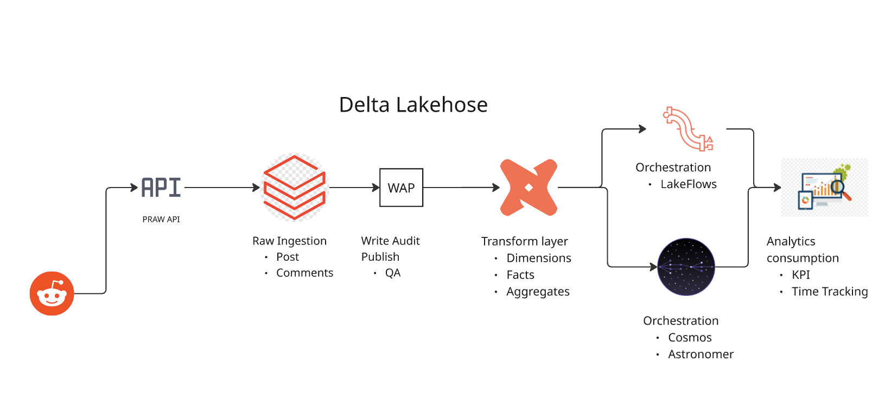
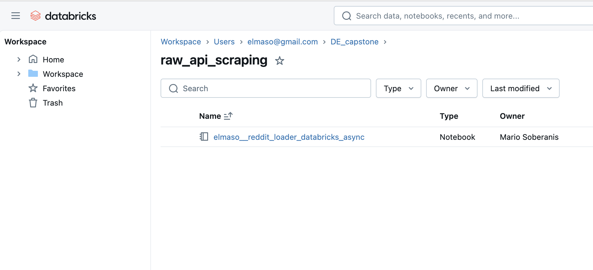
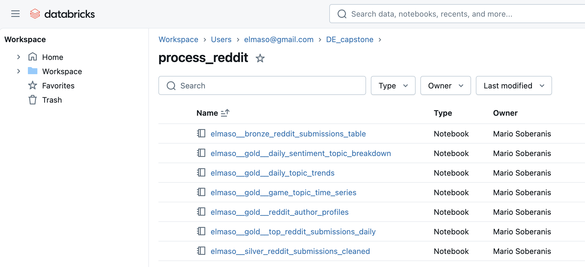
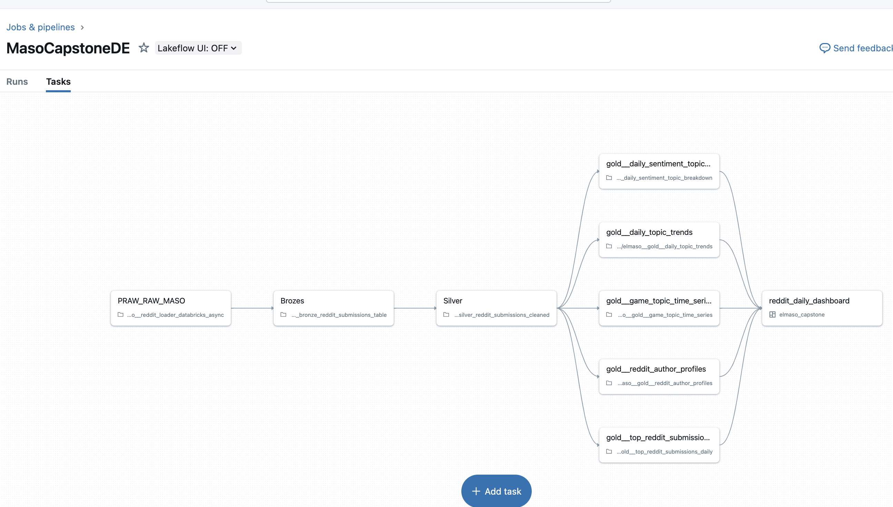
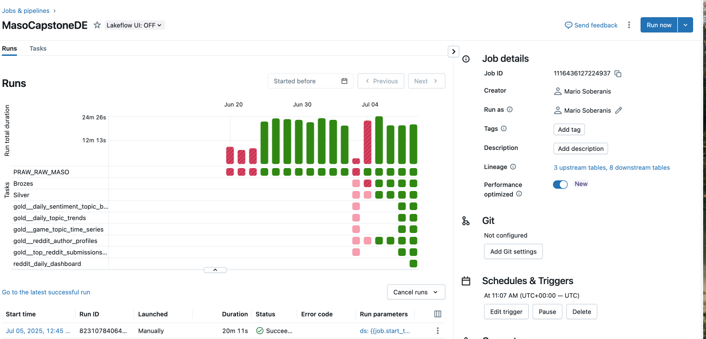
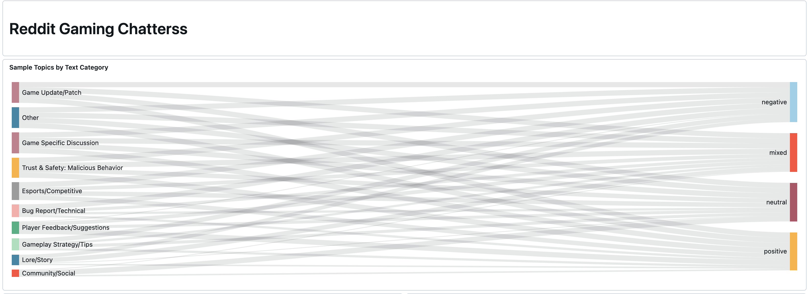
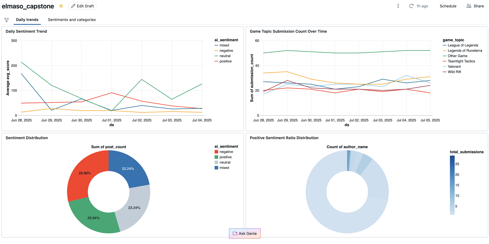
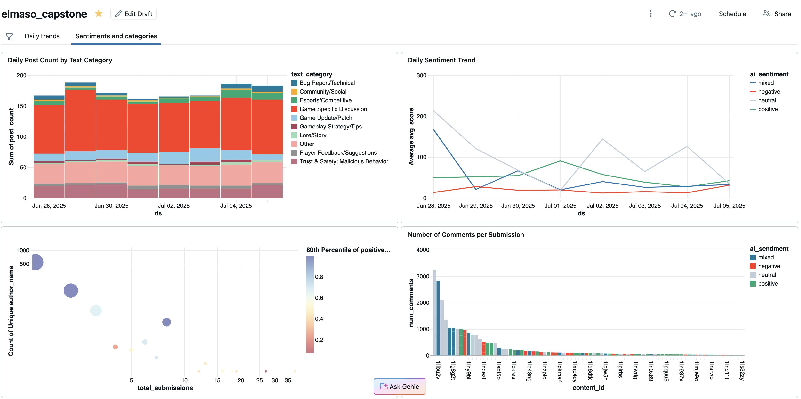

# Data-Driven Insights from Gaming Communities: A Databricks Lakehouse Capstone (MVP)
## Project Overview
This capstone project establishes a robust, end-to-end data pipeline within a **100% Databricks Lakehouse environment** to extract, process, and analyze social data from Reddit gaming communities. Building on the core idea that external context influences community dynamics, this project demonstrates the feasibility of transforming raw, high-volume social data into actionable insights for understanding player behavior and potential trust & safety concerns.

This Minimum Viable Product (MVP) showcases automated data ingestion, multi-stage transformations (Bronze, Silver, Gold), intelligent AI enrichment preparation, and a dashboard for insightful analytics, all orchestrated through a unified DAG.

## 1. Architecture & Technology Stack
The solution is built entirely on the Databricks Lakehouse Platform, leveraging its core components for scalable data processing and storage. All data is managed within Unity Catalog (UC), ensuring centralized governance and discoverability.

**Key Technologies:**

* **Cloud Platform:** AWS (underlying infrastructure for Databricks).
*  **Data Ingestion:** Python (Async PRAW) running as Databricks Jobs.
*  **Data Lakehouse:** Databricks Lakehouse Platform with Delta Lake on AWS S3 (managed by Unity Catalog).
*  **Data Transformation:** PySpark / Spark SQL running as Databricks Jobs (for Bronze, Silver, Gold layers).
*  **Orchestration:** Databricks Workflows (DAGs)  for orchestrating the E2E pipeline.
*  **Data Quality (Implicit/Conceptual):** Built-in data quality checks within transformation logic, with conceptual adherence to the Write-Audit-Publish (WAP) pattern.
*  **AI/ML Integration:** Preparation for AI enrichment, with future plans for advanced LLM integration.
* **Business Intelligence:** Databricks SQL Endpoints connected to dashboarding tools (e.g., Tableau, Metabase - *dashboard screenshot from PDF* ).

**High-Level Architecture Diagram:**

## 2. Data Pipeline & Transformations (E2E Flow)
The pipeline follows a multi-layered Lakehouse medallion architecture (Bronze, Silver, Gold) to ensure data quality, usability, and performance.

### 2.1. Raw Ingestion Layer (Bronze Zone)
* **Purpose:** To ingest raw, immutable Reddit data into the Lakehouse.
* **Source:** Reddit API (via PRAW).
* **Process:** An asynchronous Python script (elmaso__reddit_loader_databricks_async.py) runs as a Databricks Job. This job efficiently fetches both new submissions and their comments in a single concurrent process.
* **Output:** Data is landed into Unity Catalog Delta tables, typically one table for raw submissions (e.g., tabular.dataexpert.elmaso__raw_reddit_riot_submissions_async) and one for raw comments. Each record includes a ds (ingestion date) partition and _loaded_at_timestamp_utc for auditability and idempotency.

### 2.2. Bronze Layer (Cleaned & De-duplicated)
* **Purpose:** To clean, standardize, and de-duplicate raw data, providing a reliable foundation for downstream analysis.
* **Process:** A Databricks Job (PySpark/Spark SQL) reads from the raw layer.
  *  **De-duplication:** Uses window functions (ROW_NUMBER() OVER(PARTITION BY submission_id ORDER BY _loaded_at_timestamp_utc DESC)) to select the most recently loaded version of each unique submission (or comment), effectively eliminating duplicates arising from repeated fetches of the same active content across different days.
  *  **Basic Cleaning:** Performs initial type conversions and handles common nulls/edge cases.
* **Output:** Cleaned Bronze Delta tables (e.g., tabular.dataexpert.elmaso__bronze_reddit_submissions_table).
### 2.3. Silver Layer (Enriched & Prepared for AI)
* **Purpose:** To enrich the cleaned data with derived features, binning, rule-based categorization, and prepare for cost-optimized AI enrichment.
* **Process:** A Databricks Job (elmaso__silver_reddit_submissions_cleaned.py) (PySpark/Spark SQL) reads from the Bronze layer.
    *   **Cardinality Reduction:** Converts continuous numerical metrics (like score, num_comments, upvote_ratio) into categorical bins (score_bin, num_comments_bin, upvote_ratio_bin) for easier analysis and visualization.
    *   **Rule-Based Categorization:** Applies detailed CASE WHEN logic to title, selftext, and subreddit to assign post_category and game_topic (e.g., "Game Update/Patch", "Trust & Safety: Malicious Behavior").
    *   **AI Enrichment Candidate Flagging:** Adds a boolean flag (is_ai_enrichment_candidate) to mark content that is "interesting" enough (e.g., trending, high score, long text, or falls into "Trust & Safety" categories) for future, expensive AI processing. This is a key cost optimization strategy to avoid running LLMs on every piece of raw data.
    *   **AI Placeholder Columns:** Includes NULL columns for future AI-derived sentiment, topics, entities, and moderation flags, defining the schema for subsequent enrichment in a dedicated AI-focused phase.
* **Output:** Enriched Silver Delta tables (e.g., tabular.dataexpert.elmaso__silver_reddit_submissions_cleaned).

### 2.4. Gold Layer (Aggregated for Dashboarding)
*   **Purpose:** To create highly aggregated and optimized tables for fast consumption by dashboards and analytical tools.
*   **Process:** Databricks Jobs (PySpark/Spark SQL) read from the Silver layer. These jobs perform various aggregations based on common analytical patterns.
Aggregations: Creates at least 5 key aggregate tables (e.g., daily subreddit activity, daily content category trends, top authors daily, trending content summary, AI sentiment summaries).
*   **Output:** Gold Delta tables (e.g., tabular.dataexpert.elmaso__gold_daily_subreddit_activity).
## 3. Data Quality & Reliability
*   **Unity Catalog (UC):** All tables are managed in UC, providing centralized metadata, access control, and schema governance.
*   **Idempotent Jobs:** Ingestion and transformation jobs are designed to be idempotent using Delta Lake's mode("overwrite").option("replaceWhere", ...) for daily partitions, ensuring reliable re-runs without data duplication.
*   **De-duplication:** The Bronze layer specifically implements robust de-duplication logic (using window functions) to ensure unique records for analytical accuracy, even if fetched multiple times from the API.
*   **Type Conformance:** Data types are consistently cast and enforced at each layer, from raw string types to precise numerical, boolean, and timestamp types.
*   **Conceptual WAP:** The multi-layered architecture inherently supports the Write-Audit-Publish (WAP) concept, where data is progressively refined and quality-checked before being exposed to final consumers.
## 4. Orchestration & Data Freshness
The entire data pipeline is orchestrated using Databricks Workflows (DAGs). This provides:

*   **End-to-End Data Freshness:** Dependencies are explicitly defined, ensuring transformations only run after their upstream sources are successfully updated.
*   **Efficient Compute:** Jobs are triggered only when needed, optimizing resource utilization.
*   **Backfill Capability:** The pipeline was successfully backfilled for 1 week of historical data, demonstrating its ability to process past data.

## 5. Dashboard & Insights
*   **Connected to Gold:** A dashboard (e.g., built in Tableau or Metabase, refer to elmaso_capstone 2025-07-05 19_39.pdf) is directly connected to the 5 Gold aggregate tables, ensuring super-fast query performance.
*   **Insightful Analytics:** The dashboard provides key insights into:
    *   Daily/weekly subreddit activity and engagement trends.
    *   Performance of different content categories (rule-based and AI-prepared).
    *   Identification of trending content.
    *   Initial views into AI-derived sentiment for filtered content.

## 2. Data Pipeline & Transformations (E2E Flow)

The pipeline follows a multi-layered Lakehouse medallion architecture (Bronze, Silver, Gold) to ensure data quality, usability, and performance.

## 6. Future Enhancements

This MVP provides a strong foundation. Future work will focus on:

* **Advanced AI/ML Integration:** Integrating Databricks Foundation Models or fine-tuned LLMs for granular sentiment, topic extraction, entity recognition, and building sophisticated AI models for trust & safety (e.g., toxicity, threat detection, summarization).
* **Real-time & Expanded Data:** Investigating streaming capabilities (e.g., DLT, Spark Streaming) for near real-time insights, and integrating external data sources (news, politics, economics) for deeper correlation analysis.
* **Actionable Applications:** Developing user-facing applications (e.g., Databricks SQL Dashboards, Flask apps) to deliver insights directly to community managers and developers.
* **Enhanced Data Quality:** Implementing more extensive `dbt test` or custom data quality checks (e.g., Great Expectations) across all layers.
